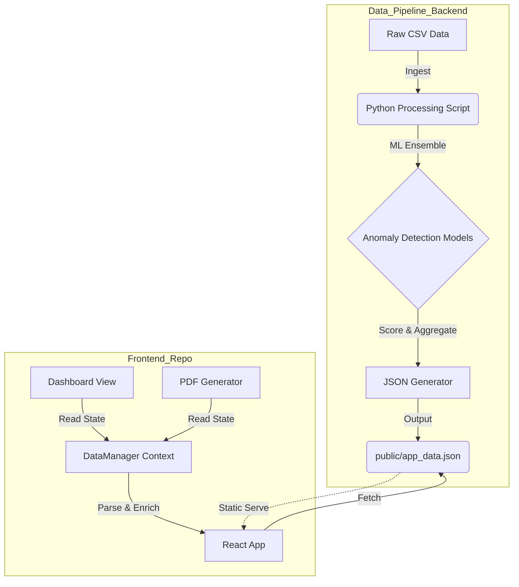
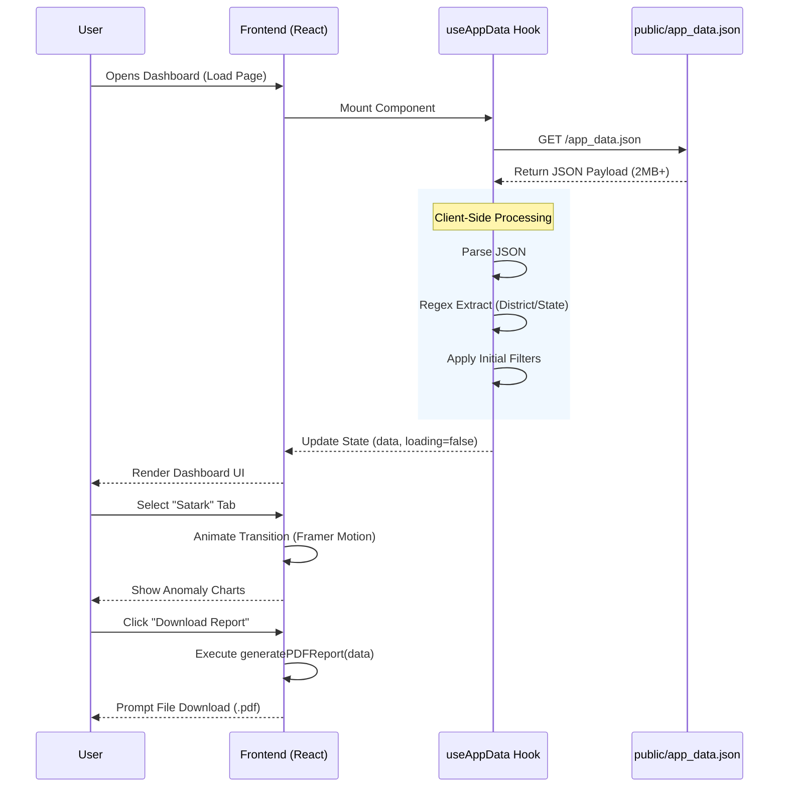

# TECHNICAL_DEEP_DIVE.md

Project Name: **UIDAI OpsCommand Dashboard**

## 1. High-Level Summary
**One-liner:** A comprehensive, real-time-simulated operations command dashboard for UIDAI to monitor Aadhaar operations, security (Satark), compliance (Saksham), field tasks (Kartavya), and migration trends (Pravas).

**Problem Solved:** Adhaar operations generate massive amounts of data across scattered systems. Administrators lack a unified "Single Pane of Glass" to visualize fraud anomalies, monitor MBU (Mandatory Biometric Update) compliance backlogs, and efficiently allocate field tasks based on geospatial insights.

**Target Audience:** UIDAI Administrators, Field Operation Managers, and Data Analysts.

## 2. Technical Stack
### Frontend
- **Framework:** React 18 with TypeScript
- **Build Tool:** Vite (SWC plugin)
- **Styling:** Tailwind CSS + Shadcn UI (Radix Primitives) + Lucide React Icons
- **State Management:** React Hooks (`useState`, `useContext`, `useMemo`) + TanStack Query (configured but primarily used for JSON fetching)
- **Visualization:** Recharts (Bar, Scatter, Pie charts)
- **Animations:** Framer Motion (`AnimatePresence`, `motion.div`)
- **PDF Generation:** jsPDF (Client-side generation)
- **Routing:** React Router DOM (v6)

### Backend (Inferred)
*Note: The current codebase consumes a static `app_data.json`. The architecture implies a backend data pipeline.*
- **Logic:** Python Data Pipeline (`generate_insights.py`)
- **Functions:** Data cleaning, multi-part CSV ingestion, and JSON output generation.
- **Output:** `app_data.json` served statically to the frontend.

### AI/ML Models (Backend Pipeline)
- **Anomaly Detection:** Ensemble learning approach (Isolation Forest, Local Outlier Factor) to score "Fraud Probability" and "Confidence".
- **Logic:** identifying unusual patterns in enrollment data (e.g., high update frequency in specific pincodes).

### Infrastructure
- **Hosting:** Static Site Generation (Vite Build) -> Capable of deploying to Vercel, Netlify, or S3.
- **Asset Delivery:** Public directory serving `app_data.json`.

## 3. Key Features & Implementation Details

### Feature: Smart PDF Reporting
**Logic:** Generates a multi-page executive summary PDF directly in the browser. It captures the current state of the dashboard, including filtered metrics, critical alerts, and top deficit districts.
- **Key File:** `src/utils/pdfGenerator.ts`
- **Algorithm:**
    1.  **Canvas Drawing:** Uses `jspdf` primitive shapes (`rect`, `text`) to draw headers/footers manually.
    2.  **Dynamic Pagination:** Tracks `yPos` (vertical cursor); checks `if (yPos > 250)` to trigger `pdf.addPage()`.
    3.  **Data Filtering:** Injects current `AppData` and `FilterState` to render contextual "Applied Filters" and specific filtered lists (e.g., "Top 5 Fraud Cases").
    4.  **Formatting:** Auto-formats numbers with `toLocaleString` and dates with `toLocaleDateString('en-IN')`.

### Feature: Data Enrichment Hook (`useAppData`)
**Logic:** The raw JSON data contains unstructured text fields (e.g., WhatsApp messages) that need to be parsed into structured data for filtering.
- **Key File:** `src/hooks/useAppData.ts`
- **Algorithm:**
    1.  **Regex Parsing:** Uses regex `/📍\s*([^,\n]+),\s*([^\n]+)/` to extract "District" and "State" from `whatsapp_msg` string in `action_tickets`.
    2.  **Memoization:** Uses `useMemo` to re-calculate derived datasets (`filteredActionTickets`, `uniqueStates`, `uniqueDistricts`) only when `filters` or `data` change, optimizing performance for large datasets.
    3.  **Client-Side Search:** Implements multi-field search (Pincode, District, Task Name) using `toLowerCase().includes()`.

### Feature: "Satark" Anomaly Visualization
**Logic:** Displays fraud/anomaly detection results with visual indicators for risk levels.
- **Key File:** `src/components/dashboard/SatarkView.tsx`
- **Visualization:** Uses `recharts` to render:
    -   **Confidence Distribution:** Pie Chart showing the breakdown of High/Medium/Low confidence alerts.
    -   **Metric Cards:** React components displaying aggregated counters (Total Analyzed, High Risk).

## 4. Architecture & Data Flow

### A. System Architecture Diagram



### B. Request/Response Flow Diagram



## 5. Challenges & Solutions

### Challenge 1: Handling Unstructured Location Data
**Problem:** The raw ticket data comes with a free-text `whatsapp_msg` field containing the location, rather than structured `state` and `district` columns. This makes filtering by State or District impossible on the raw JSON.
**Solution:** Implemented a Regex-based parser in `useAppData.ts` (`extractLocationFromMessage`). This runs once on data load to "enrich" the `action_tickets` array, creating virtual columns for `district` and `state` that power the `FilterBar` and `uniqueDistricts` logic.

### Challenge 2: Client-side PDF Pagination
**Problem:** The Executive Summary report length varies based on the number of filtered items (e.g., number of Fraud Cases). A static layout would cut off content or overflow the page.
**Solution:** Used a "cursor-based" rendering approach in `pdfGenerator.ts`. A `yPos` variable tracks the current vertical position. Before rendering a new section, the code checks `if (yPos > 250)`. If true, it calls `pdf.addPage()` and resets `yPos = 20`, ensuring content flows gracefully across multiple pages.

### Challenge 3: Performance with Large Datasets
**Problem:** Filtering thousands of `compliance_map_data` entries on every keystroke in the search bar causes UI lag.
**Solution:** Heavily leveraged `useMemo` in `useFilteredData`. The derived arrays (`filteredActionTickets`, `filteredComplianceData`) are only recalculated when dependencies (`data`, `filters`) strictly change. This prevents expensive array iterations on purely cosmetic re-renders (like opening the sidebar).

## 6. Installation & Setup

### Prerequisites
- **Node.js:** v18.0.0 or higher
- **npm:** v9.0.0 or higher
- **Git**

### Environment Variables
Create a `.env` file in the root directory (optional for this version as it uses static data):
```env
VITE_API_URL=http://localhost:8000 # If connecting to a live backend
```

### Frontend Setup
1.  **Clone the repository:**
    ```bash
    git clone https://github.com/Mrigank005/UIDAI-Hackathon-Frontend.git
    cd UIDAI-Hackathon-Frontend
    ```

2.  **Install Dependencies:**
    ```bash
    npm install
    ```

3.  **Run Development Server:**
    ```bash
    npm run dev
    ```
    Access the app at `http://localhost:8080`.

4.  **Build for Production:**
    ```bash
    npm run build
    npm run preview
    ```
